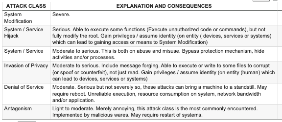
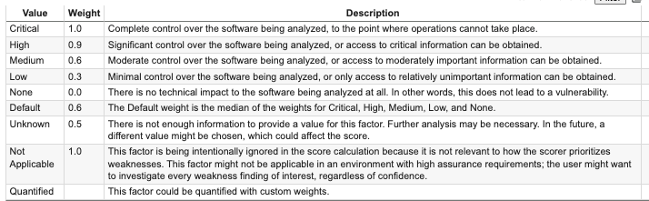
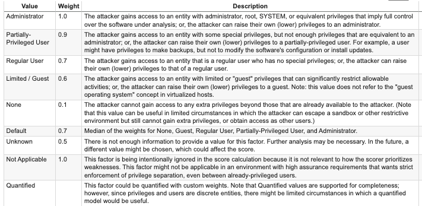
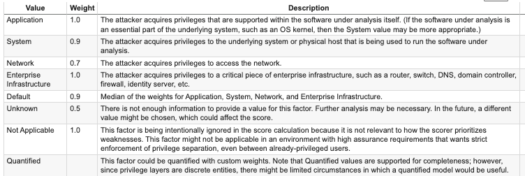
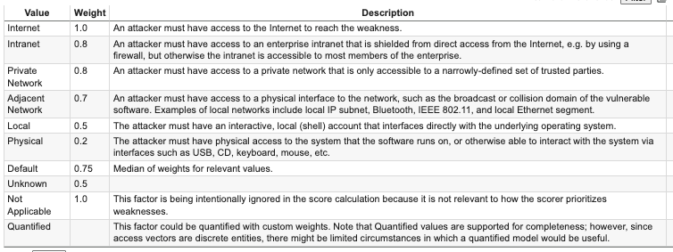
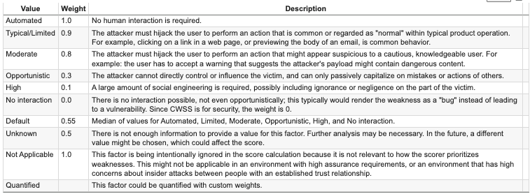

# CVE Data Analysis

This project extracts and visualizes Common Vulnerabilities and Exposures (CVE) data, focusing on key metrics like CVSS base scores, CVSS severity, attack vectors, and the number of CVEs per year.

## Project Overview

The project involves the following steps:
1. Extracting relevant data from a DataFrame containing CVE information.
2. Visualizing the extracted data using `matplotlib` and `seaborn`.

## Visualizations

The following charts are generated:
1. **Distribution of CVSS Base Scores:** Shows the frequency distribution of CVSS base scores.
2. **CVSS Severity Distribution:** Displays the count of CVEs by severity level (LOW, MEDIUM, HIGH, CRITICAL).
3. **Attack Vector Distribution:** Illustrates the count of CVEs by attack vector (NETWORK, ADJACENT_NETWORK, LOCAL, PHYSICAL).
4. **Number of CVEs per Year:** Plots the number of CVEs published each year.

### Distribution of CVSS Base Scores


### CVSS Severity Distribution


### Attack Vector Distribution


### Number of CVEs per Year


## Setup

1. Ensure you have Python installed.
2. Install the required libraries:
    ```bash
    pip install pandas matplotlib seaborn
    ```

## Usage

1. Run the script to generate the visualizations:
    ```python
    python cve_analysis.py
    ```

2. The script will display the following charts:
    - Distribution of CVSS Base Scores
    - CVSS Severity Distribution
    - Attack Vector Distribution
    - Number of CVEs per Year

```
%%writefile ./sample_data/data.txt
Value[delimiter]Weight[delimiter]Description[delimiter]
...
:

```

```
!curl -O https://raw.githubusercontent.com/ursa-mikail/data_format/main/tabulated_data_markup_language_tdml_file_into_a_csv/method_01/tdml_file_into_csv.py

!git clone https://github.com/ursa-mikail/data_format.git
!cd data_format/tabulated_data_markup_language_tdml_file_into_a_csv/method_01
!python tdml_file_into_csv.py
```





Access Vector 



